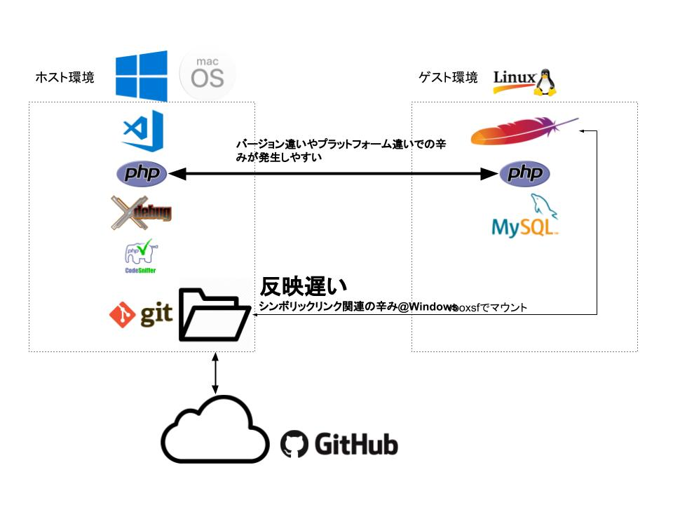
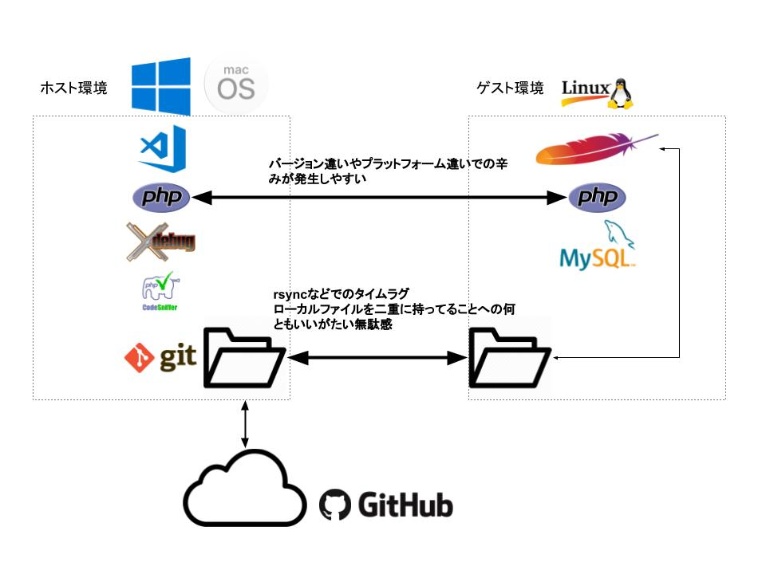
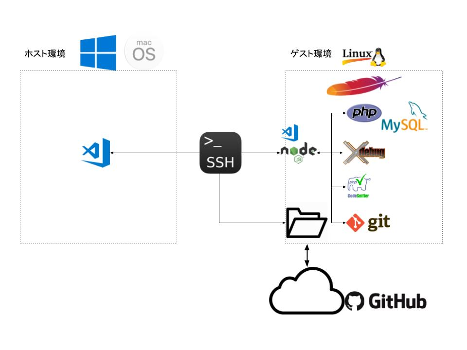

# We Love Virtual Machines
仮想環境をより便利に使うツールたち

---

## 自己紹介

---

## 仮想環境使ってますか？

---

## よくあるWeb開発の形

- サーバはたぶんLinuxかFreeBSDなどの*nix系
- 開発者にあてがわれているのはWindowsがインストールされたPC
- たまにMac

---

## ひと昔前だと

- 開発中の確認用に本番用とは別のサーバを借りてアップロード
- アップロードが面倒なので社内にサーバをたててSambaとかでネットワークドライブにしたり

---

## 構築が面倒
## アップロードが面倒
## 共用なのでデグレがこわい

---

## 今

てもとのマシンに仮想環境で物理サーバのような環境を作ってそこで開発

---

### 背景は技術の進歩と 「人権意識」の高まり

- ハードウェアによる仮想化支援をサポートしたマルチコア・マルチスレッドなCPU
- SSDの普及(I/O周りのボトルネック解消)
- 割と豊富なメモリ

---

### Vagrant + VirtualBox
- 豊富なテンプレート(box) <!-- .element: class="fragment" data-fragment-index="1" -->
- プロビジョニングによるカスタマイズの自動化 <!-- .element: class="fragment" data-fragment-index="2" -->
- 設定やプロビジョニング関連ファイルは基本テキスト <!-- .element: class="fragment" data-fragment-index="3" -->
  - gitで管理してればどこでも同じ環境を作れる <!-- .element: class="fragment" data-fragment-index="4" -->
  - 「秘伝のタレ」を回避できる <!-- .element: class="fragment" data-fragment-index="5" -->
- 手軽に作れて手軽に壊せるのは初期の試行錯誤には大きなメリット <!-- .element: class="fragment" data-fragment-index="6" -->

---

### 例

[https://github.com/takwat/vagrant-lamp](https://github.com/takwat/vagrant-lamp)

---

## 仮想化ソフトについて

今はVagrant+VirtualBoxがいい意味で枯れてるので個人的に気に入って使っていますが

Windows 10ならWindows Subsystem for Linux(WSL)という面白そうな環境もあるので試してみるのもいいかもしれません

次のWindows 10の大規模アップデートでMSが本気出して作ったLinuxカーネルでかなりパフォーマンスが上がったWSL2というのが入るとか入らないとか

現状のWSL使ってみたときはファイルI/OとDocker周りのサポートが少し残念な感じになっていたのでWSL2には期待してます

---

### 仮想環境も解決できない辛み(1)

---

### 仮想環境も解決できない辛み(2)

---

### Remote Development

---

- エディタのUI部分だけホスト(Windows/Mac)側で動いてますという形
- 編集対象はゲスト側のローカルファイル
- gitやPHPの実行エンジン(XDebug含む)などはゲスト側で動いているものを使う
  - ホスト側にはVirtualBox / Vagrant / VSCode関連以外の開発ツールは一切インストール不要
- 実行・停止の指令と動作状態のモニタリングをサーバ側にインストールされたnode.js製のプラグインなどで行ってホスト側に転送
  - SSHぶんのオーバーヘッドはあるもののそこまで気にならない

---

## ngrok
