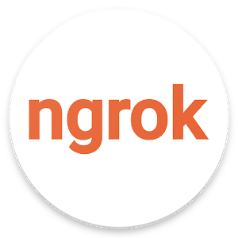

# We Love Virtual Machines
仮想環境をより便利に使うツールたち

---

## 自己紹介(1)

<ul>
    <li class="fragment" data-fragment-index="1">Qiita</li>
    <li class="fragment" data-fragment-index="2">https://qiita.com/_takwat/</li>
    <li class="fragment" data-fragment-index="3">0x2c歳</li>
</ul>

---

## 自己紹介(2)
### I Like ...
<ul>
    <li class="fragment" data-fragment-index="1">Slim Framework</li>
    <li class="fragment" data-fragment-index="2">Laravel</li>
    <li class="fragment" data-fragment-index="3">Vue.js</li>
    <li class="fragment" data-fragment-index="4">Vagrant</li>
    <li class="fragment" data-fragment-index="5">Firebase</li>
    <li class="fragment" data-fragment-index="6">MongoDB</li>
    <li class="fragment" data-fragment-index="7">ELK Stack</li>
</ul>

### And ...  <!-- .element: class="fragment" data-fragment-index="7" -->

<h3 class="fragment" data-fragment-index="8">&nbsp;Visual Studio Code</h3>

---

## ここからの予定

- VSCode Remote Development <!-- .element: class="fragment" data-fragment-index="1" -->
- ngrok <!-- .element: class="fragment" data-fragment-index="2" -->

---

## ひと昔前のWeb開発現場

#### 開発中の確認用に本番用やステージング用とは <!-- .element: class="fragment" data-fragment-index="1" -->
### 別のサーバをたてて
### アップロード <!-- .element: class="fragment" data-fragment-index="3" -->

---

## 今にして思えば
### マシン代と電気代 <!-- .element: class="fragment" data-fragment-index="1" -->
### 構築の手間 <!-- .element: class="fragment" data-fragment-index="2" -->
### 複数人で共用してるがゆえの上書きによるデグレの手戻り <!-- .element: class="fragment" data-fragment-index="3" -->

&nbsp;

## お財布に優しくない <!-- .element: class="fragment" data-fragment-index="4" -->

---

## 時代は変わり

### CPUの仮想化支援と多コア多スレッド化(Core / Ryzen) <!-- .element: class="fragment" data-fragment-index="1" -->
### SSDやメモリの大容量化と価格低下 <!-- .element: class="fragment" data-fragment-index="2" -->
### 今時の「人権」環境なら仮想環境作ってもあまり辛くはない <!-- .element: class="fragment" data-fragment-index="3" -->

---

### 仮想化環境下での開発のメリット

<ul>
    <li class="fragment" data-fragment-index="1">秘伝のタレの防止</li>
    <ul>
        <li class="fragment" data-fragment-index="2">プロビジョニングによるカスタマイズの自動化</li>
        <li class="fragment" data-fragment-index="3">SCMで管理してれば開発者同士で同じ環境を共有できる</li>
    </ul>
    <li class="fragment" data-fragment-index="4">手軽に作れて手軽に壊せるのは初期の試行錯誤には大きなメリット</li>
</ul>

---

### 例

[https://github.com/takwat/vagrant-lamp](https://github.com/takwat/vagrant-lamp)

---

## ただし「銀の弾丸」ではない

---

### 直面する辛み(1)

---

---

### 直面する辛み(2)

---

---

## ホスト側で動いている開発環境とゲスト側とのファイルや環境の整合性の同期が主な要因

---

## VSCode Remote Development Extension

---

<aside class="notes">
- エディタのUI部分だけホスト(Windows/Mac)側で動いてますという形
- 編集対象はゲスト側のローカルファイル
- gitやPHPの実行エンジン(XDebug含む)などはゲスト側で動いているものを使う
- ホスト側にはVirtualBox / Vagrant / VSCode関連以外の開発ツールは一切インストール不要
- 実行・停止の指令と動作状態のモニタリングをサーバ側にインストールされたnode.js製のプラグインなどで行ってホスト側に転送
- SSHぶんのオーバーヘッドはあるもののそこまで気にならない
</aside>

---

## てもとの仮想環境で開発してたある日

---

---

# &#x1f47c;&nbsp;動いてること見たいなあ

---

# &#x1f641;

---

## じゃあ、どっかにデプロイする？

---

## ぶっちゃけ面倒&#x1f630;

---

## APIのコールバックとかだとSSL対応もしないと辛い&#x1f914;

---

## ngrok 降臨

---

---

## ただし

<ul>
    <li>有料プランじゃないとすぐ1分あたりのリクエスト数の上限に引っかかる&#x1f631;</li>
    <li class="fragment" data-fragment-index="1">APIなどのテスト向きかも</li>
    <li class="fragment" data-fragment-index="2">Vagrantにあるshareというプラグインも裏側でこれ使ってます</li>
</ul>

---

## 似たようなサービス

---

### serveo

https://serveo.net/

---

<ul>
    <li>サービスがたまに落ちてる&#x1f607;</li>
    <li class="fragment" data-fragment-index="1">自鯖・自ドメインで環境作れる</li>
    <li class="fragment" data-fragment-index="2">ただのトンネルなのでどこかの安鯖にたててもいいかもしれない</li>
</ul>

---

### Localtunnel

https://localtunnel.github.io/www/

---

<ul>
    <li>npm installなのでクライアントのインストールが楽</li>
    <li class="fragment" data-fragment-index="1">自鯖・自ドメインで環境作れる</li>
    <li class="fragment" data-fragment-index="2">若干パフォーマンスが不安</li>
</ul>

---

## まとめ

<ul>
    <li class="fragment" data-fragment-index="1">開発環境と普段使いの環境の隔離</li>
    <li class="fragment" data-fragment-index="2">VSCode使いならRemote Developmentは入れといたほうが幸せ</li>
    <li class="fragment" data-fragment-index="3">簡易的ではあるものの仮想環境をグローバルに晒す手段もあるので用法容量をよく守ってお使いください</li>
</ul>

---

# 本題終わり

---

## 余談

---

# ありがとうございました
