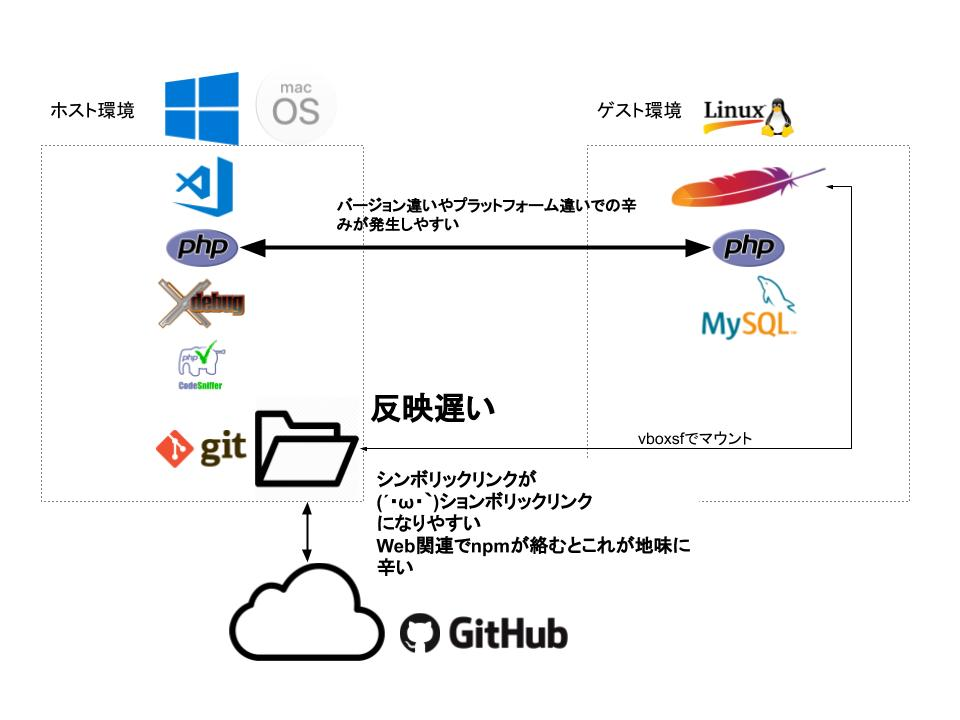
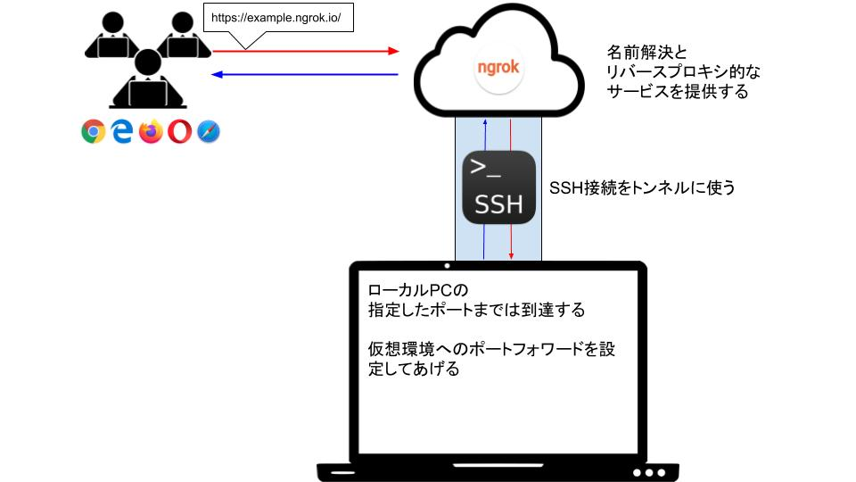

# We Love Virtual Machines
仮想環境をより便利に使うツールたち

---

## 自己紹介(1)

<ul>
    <li class="fragment" data-fragment-index="1">0x2c歳</li>
    <li class="fragment" data-fragment-index="2">サーバサイドメイン</li>
    <li class="fragment" data-fragment-index="3">入社3ヶ月目のペーペーです</li>
    <li class="fragment" data-fragment-index="4">ゆえにこれまで発表された皆さんのような立派なことは言えません</li>
</ul>

---

## 自己紹介(2)
### I Like ...
<ul>
    <li class="fragment" data-fragment-index="1">Slim Framework</li>
    <li class="fragment" data-fragment-index="2">Vue.js</li>
    <li class="fragment" data-fragment-index="3">Vagrant</li>
    <li class="fragment" data-fragment-index="4">Firebase</li>
    <li class="fragment" data-fragment-index="5">MongoDB</li>
    <li class="fragment" data-fragment-index="6">ELK Stack</li>
</ul>

### And ...  <!-- .element: class="fragment" data-fragment-index="7" -->

<ul>
    <li class="fragment" data-fragment-index="8">Visual Studio Code</li>
</ul>

---

## ここからの予定

- VSCode Remote Development <!-- .element: class="fragment" data-fragment-index="1" -->
- ngrok <!-- .element: class="fragment" data-fragment-index="2" -->

---

## ひと昔前のWeb開発あるある

#### 開発中の確認用に本番用やステージング用とは <!-- .element: class="fragment" data-fragment-index="1" -->
### 別のサーバをたてて
### アップロード <!-- .element: class="fragment" data-fragment-index="3" -->

---

## 今にして思えば
### マシン代と電気代 <!-- .element: class="fragment" data-fragment-index="1" -->
### 構築の手間 <!-- .element: class="fragment" data-fragment-index="2" -->
### 複数人で共用してるがゆえの上書きによるデグレの手戻り <!-- .element: class="fragment" data-fragment-index="3" -->

&nbsp;

## お財布に優しくない <!-- .element: class="fragment" data-fragment-index="4" -->

---

## 時代は変わり

### CPUの仮想化支援と多コア多スレッド化 <!-- .element: class="fragment" data-fragment-index="1" -->
### SSDやメモリの大容量化と価格低下 <!-- .element: class="fragment" data-fragment-index="2" -->

---

## つまり

### てもとのパソコンで仮想環境作っても辛くない <!-- .element: class="fragment" data-fragment-index="2" -->

---

### 仮想化環境下での開発のメリット

<ul>
    <li class="fragment" data-fragment-index="1">秘伝のタレの防止</li>
    <ul>
        <li class="fragment" data-fragment-index="2">プロビジョニングによるカスタマイズの自動化</li>
        <li class="fragment" data-fragment-index="4">gitで管理してればどこでも同じ環境を作れる</li>
    </ul>
    <li class="fragment" data-fragment-index="6">手軽に作れて手軽に壊せるのは初期の試行錯誤には大きなメリット</li>
</ul>

---

### 例

[https://github.com/takwat/vagrant-lamp](https://github.com/takwat/vagrant-lamp)

---

## 個人的に注目の仮想化ソフト
### WSL(Windows Subsystem for Linux)
- 起動が早くWindowsのアプリ感覚でUbuntuが立ち上がるのは楽しい <!-- .element: class="fragment" data-fragment-index="1" -->
- でも現状では結構残念ポイントが多い <!-- .element: class="fragment" data-fragment-index="2" -->
- 次期Windows 10の大規模アップデートでMSが本気を出して作ったLinuxカーネルが登場予定 <!-- .element: class="fragment" data-fragment-index="3" -->
- かなりパフォーマンスが上がって残念ポイントが解決されているらしい <!-- .element: class="fragment" data-fragment-index="4" -->

---

### 仮想環境で直面する辛み(1)

---

---

### 仮想環境で直面する辛み(2)

---

---

### VSCode Remote Development Extension

---

<aside class="notes">
- エディタのUI部分だけホスト(Windows/Mac)側で動いてますという形
- 編集対象はゲスト側のローカルファイル
- gitやPHPの実行エンジン(XDebug含む)などはゲスト側で動いているものを使う
- ホスト側にはVirtualBox / Vagrant / VSCode関連以外の開発ツールは一切インストール不要
- 実行・停止の指令と動作状態のモニタリングをサーバ側にインストールされたnode.js製のプラグインなどで行ってホスト側に転送
- SSHぶんのオーバーヘッドはあるもののそこまで気にならない
</aside>

---

## てもとの仮想環境で開発してたある日

---

## 動いてること見せてもらえない？

---

## どっかにデプロイする？

---

## ぶっちゃけ面倒('A`)

---

## ngrok

---

---

## ただし

<ul>
    <li>有料プランじゃないとすぐ1分あたりのリクエスト数の上限に引っかかる</li>
    <li class="fragment" data-fragment-index="1">APIなどのテスト向きかも</li>
    <li class="fragment" data-fragment-index="2">Vagrantにあるshareというプラグインも裏側でこれ使ってます</li>
</ul>

---

## 似たようなサービス

---

### serveo

https://serveo.net/

---

<ul>
    <li>サービスがたまに落ちてる</li>
    <li class="fragment" data-fragment-index="1">自鯖・自ドメインで環境作れる</li>
</ul>

---

### Localtunnel

https://localtunnel.github.io/www/

---

<ul>
    <li>npm installなのでクライアントのインストールが楽</li>
    <li class="fragment" data-fragment-index="1">若干パフォーマンスが不安</li>
</ul>

---

## まとめ

<ul>
    <li class="fragment" data-fragment-index="1">仮想環境はいいもの</li>
    <li class="fragment" data-fragment-index="2">VSCodeで仮想環境いじるならRemote Developmentは入れといたほうが幸せ</li>
    <li class="fragment" data-fragment-index="3">開発ツールでWindowsやmacのローカル環境汚さないのは安心</li>
</ul>

---

# ありがとうございました
